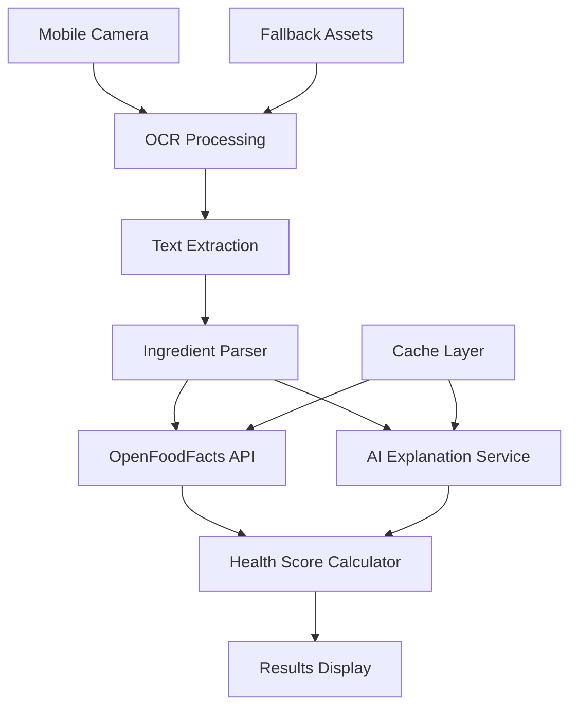

# Design Document

## Overview

SnackCheck is a mobile-first Progressive Web App (PWA) built with Next.js that enables users to scan food labels, decode ingredients, and receive instant health scores. The application follows a three-stage pipeline: OCR text extraction, ingredient analysis via OpenFoodFacts API, and AI-powered health scoring with explanations.

The architecture prioritizes speed (≤5 second scan-to-result), reliability (80%+ OCR accuracy), and mobile usability while maintaining hackathon-appropriate simplicity.

## Architecture

### High-Level Architecture



### Technology Stack

- **Frontend Framework**: Next.js 14 with App Router
- **OCR Engine**: Tesseract.js (client-side processing)
- **Data Source**: OpenFoodFacts REST API
- **AI Service**: Kiro LLM integration
- **Styling**: Tailwind CSS for mobile-first responsive design
- **State Management**: React hooks with Context API
- **Caching**: Browser localStorage + Service Worker
- **Deployment**: Vercel (optimized for Next.js)

### Data Flow

1. **Capture Phase**: User captures image via device camera
2. **Processing Phase**: Tesseract.js extracts text from image
3. **Parsing Phase**: Custom parser identifies ingredient lists
4. **Lookup Phase**: Parallel queries to OpenFoodFacts API and AI service
5. **Scoring Phase**: Algorithm calculates health score based on ingredient data
6. **Display Phase**: Color-coded results with explanations

## Components and Interfaces

### Core Components

#### 1. CameraCapture Component
```typescript
interface CameraProps {
  onImageCapture: (imageData: string) => void;
  isProcessing: boolean;
}
```
- Handles device camera access
- Provides viewfinder with label positioning guides
- Captures high-quality images optimized for OCR

#### 2. OCRProcessor Service
```typescript
interface OCRResult {
  text: string;
  confidence: number;
  ingredients: string[];
}

class OCRProcessor {
  async processImage(imageData: string): Promise<OCRResult>
  private parseIngredients(text: string): string[]
}
```
- Integrates Tesseract.js for text extraction
- Implements ingredient list parsing logic
- Handles OCR confidence scoring

#### 3. IngredientLookup Service
```typescript
interface IngredientData {
  name: string;
  source: 'openfoodfacts' | 'ai' | 'cache';
  nutritionScore?: number;
  additiveClass?: string;
  explanation?: string;
}

class IngredientLookup {
  async lookupIngredient(name: string): Promise<IngredientData>
  private queryOpenFoodFacts(ingredient: string): Promise<any>
  private getAIExplanation(ingredient: string): Promise<string>
}
```
- Manages OpenFoodFacts API integration
- Handles AI fallback for unknown ingredients
- Implements caching strategy

#### 4. HealthScoreCalculator Service
```typescript
interface HealthScore {
  overall: number; // 0-100
  color: 'green' | 'yellow' | 'red';
  factors: ScoreFactor[];
}

interface ScoreFactor {
  ingredient: string;
  impact: number;
  reason: string;
}

class HealthScoreCalculator {
  calculateScore(ingredients: IngredientData[]): HealthScore
  private getColorCode(score: number): string
}
```
- Implements health scoring algorithm
- Assigns color codes based on thresholds
- Provides detailed factor breakdown

#### 5. ResultsDisplay Component
```typescript
interface ResultsProps {
  score: HealthScore;
  ingredients: IngredientData[];
  onNewScan: () => void;
  onShare: () => void;
}
```
- Displays color-coded health score
- Shows ingredient explanations
- Provides sharing functionality

### API Interfaces

#### OpenFoodFacts Integration
```typescript
interface OpenFoodFactsResponse {
  product: {
    ingredients_text: string;
    additives_tags: string[];
    nutrition_grades: string;
    nova_group: number;
  };
}
```

#### AI Service Integration
```typescript
interface AIExplanationRequest {
  ingredient: string;
  context: 'food_additive' | 'natural_ingredient';
}

interface AIExplanationResponse {
  explanation: string;
  healthImpact: 'positive' | 'neutral' | 'negative';
  commonUses: string[];
}
```

## Data Models

### Core Data Structures

#### Scan Session
```typescript
interface ScanSession {
  id: string;
  timestamp: Date;
  imageData: string;
  ocrResult: OCRResult;
  ingredients: IngredientData[];
  healthScore: HealthScore;
  processingTime: number;
}
```

#### Cache Entry
```typescript
interface CacheEntry {
  key: string;
  data: any;
  timestamp: Date;
  ttl: number; // Time to live in milliseconds
}
```

### Health Scoring Algorithm

The health score calculation follows this weighted approach:

1. **Base Score**: 100 points
2. **Deductions**:
   - Artificial additives: -5 to -15 points each
   - High sodium ingredients: -10 points
   - Trans fats: -20 points
   - Artificial sweeteners: -8 points
   - Preservatives: -5 points
3. **Bonuses**:
   - Natural ingredients: +2 points each
   - Organic certification indicators: +10 points
   - Whole grains: +5 points

**Color Coding**:
- Green (🟢): 70-100 points
- Yellow (🟡): 40-69 points  
- Red (🔴): 0-39 points

## Error Handling

### OCR Failure Recovery
- **Low Confidence Detection**: If OCR confidence < 60%, prompt user to retake photo
- **No Text Detected**: Provide sample images for demo purposes
- **Processing Timeout**: 10-second timeout with fallback to demo mode

### API Failure Handling
- **OpenFoodFacts Unavailable**: Use cached ingredient database (top 50 common ingredients)
- **AI Service Timeout**: Display generic "unknown ingredient" message
- **Network Connectivity**: Graceful degradation with offline-first approach

### User Experience Errors
- **Camera Access Denied**: Provide file upload alternative
- **Unsupported Browser**: Display compatibility message with recommendations
- **Performance Issues**: Implement loading states and progress indicators

## Testing Strategy

### Unit Testing
- **OCR Processing**: Test with sample food label images
- **Ingredient Parsing**: Validate parsing logic with various ingredient list formats
- **Health Scoring**: Test scoring algorithm with known ingredient combinations
- **API Integration**: Mock OpenFoodFacts responses for consistent testing

### Integration Testing
- **End-to-End Flow**: Camera capture → OCR → API lookup → scoring → display
- **Error Scenarios**: Network failures, API timeouts, invalid images
- **Performance Testing**: Measure scan-to-result timing under various conditions

### Demo Preparation
- **Fallback Assets**: Curated set of 10 food label images with known results
- **Offline Mode**: Pre-cached ingredient data for demo reliability
- **Performance Optimization**: Image compression and processing optimization

### Mobile Testing
- **Device Compatibility**: Test on iOS Safari, Chrome Android, Samsung Internet
- **Camera Functionality**: Verify camera access and image quality across devices
- **Touch Interactions**: Ensure all UI elements are touch-friendly
- **Performance**: Monitor memory usage and processing speed on mobile devices

## Security and Privacy

### Data Handling
- **Image Processing**: All OCR processing happens client-side
- **No Image Storage**: Images are processed and discarded immediately
- **API Keys**: Secure storage of OpenFoodFacts and AI service credentials
- **User Privacy**: No personal data collection or tracking

### Content Security
- **Input Validation**: Sanitize all OCR text before processing
- **API Rate Limiting**: Implement respectful API usage patterns
- **Error Information**: Avoid exposing sensitive system information in error messages